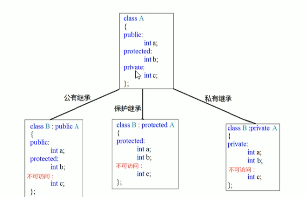

[toc]

# 类和对象

对自定义数据类型进行运算

## C++运算符重载加号

### 通过成员函数重载

```c++
#define _CRT_SECURE_NO_WARNINGS
#include<iostream>
#include<string>

using namespace std;

class person
{
public:
	person(){
	}
	
	person operator+(person& p) {
		person temp;
		temp.m_a = this->m_a + p.m_a;
		temp.m_b = this->m_b + p.m_b;
		return temp;
	}

	~person(){}
	int m_a;
	int m_b;
};

void test() {
	person p1;
	p1.m_a = 10;
	p1.m_b = 20;
	person p2;
	p2.m_a = 20;
	p2.m_b = 30;
	person p3 = p1 + p2;
	cout << "p3.m_1 = " << p3.m_a <<"\n" << "p3.m_b = " << p3.m_b << endl;
}

int main() {
	test();
	system("pause");
	return 0;
}
```

### 通过全局函数重载

```c++
#define _CRT_SECURE_NO_WARNINGS
#include<iostream>
#include<string>

using namespace std;

class person
{
public:
	person(){
	}
	
	

	~person(){}
	int m_a;
	int m_b;
};

person operator+(person& p1,person &p2) {
	person temp;
	temp.m_a = p1.m_a + p2.m_a;
	temp.m_b = p1.m_b + p2.m_b;
	return temp;
}

void test() {
	person p1;
	p1.m_a = 10;
	p1.m_b = 20;
	person p2;
	p2.m_a = 20;
	p2.m_b = 30;
	person p3 = p1 + p2;
	cout << "p3.m_1 = " << p3.m_a <<"\n" << "p3.m_b = " << p3.m_b << endl;
}

int main() {
	test();
	system("pause");
	return 0;
}
```


## C++运算符重载左移

```c++
#define _CRT_SECURE_NO_WARNINGS
#include<iostream>
#include<string>

using namespace std;

class person
{
	
	friend ostream& operator<< (ostream& cout, const person& p);
public:
	person(int a, int b) {
		m_a = a;
		m_b = b;
	}

	~person() {}
private:
	int m_a;
	int m_b;
};

// 参数p加const：表示不修改p，更规范
ostream& operator<< (ostream& cout, const person& p) {
	cout << "a=" << p.m_a << " b=" << p.m_b; 
	return cout;
}

void test() {
	person p(10, 10);
	cout << p << "\n" << "hello world" << endl;
}

int main() {
	test();
	system("pause");
	return 0;
}
```


## C++运算符重载递增

前置++

```c++
#define _CRT_SECURE_NO_WARNINGS
#include<iostream>
#include<string>

using namespace std;

class person
{
	//友元
	friend ostream& operator<<(ostream& cout, const person& p);
public:
	//函数声明
	person(int a);

	person& operator++();
	//析构函数
	~person() {}
private:
	int m_a;
};
//类外构造函数实现
person::person(int a) {
	m_a = a;
}
//类外函数实现
person& person::operator++() {
	++m_a;
	return *this;

}
//返回引用是为了对一个数据操作
//类外函数实现
ostream& operator<<(ostream& cout,const person& p) {
	cout << "a= " << p.m_a << endl;
	return cout;
}

void test() {
	person p(10);
	cout << ++p;
	cout << p;
}

int main() {
	test();
	system("pause");
	return 0;
}
```

后置++

```c++
#define _CRT_SECURE_NO_WARNINGS
#include<iostream>
#include<string>

using namespace std;

class person
{
	//友元
	friend ostream& operator<<(ostream& cout, const person& p);
public:
	//函数声明：构造
	person(int a);
	//函数声明：前置
	person& operator++();
	//函数声明：后置
	person operator++(int);
	//析构函数
	~person() {}
private:
	int m_a;
};
//类外构造函数实现
person::person(int a) {
	m_a = a;
}
//类外函数实现：前置
person& person::operator++() {
	++m_a;
	return *this;

}
//类外函数实现：后置
person person::operator++(int) {
	//记录
	person temp = *this;
	//递增
	m_a++;
	//返回
	return temp;
}
//返回引用是为了对一个数据操作
//类外函数实现
ostream& operator<<(ostream& cout,const person& p) {
	cout << "a= " << p.m_a << endl;
	return cout;
}

void test() {
	person p(10);
	cout << ++p;
	cout << p;
}

int main() {
	test();
	system("pause");
	return 0;
}
```


==前置递增返回引用，后置递增返回值==这是因为temp是局部变量，如果返回引用，temp被销毁之后引用变成野引用

## C++运算符重载赋值

> operator=对属性进行值拷贝

```c++
#define _CRT_SECURE_NO_WARNINGS
#include<iostream>
#include<string>

using namespace std;

class person
{
public:
	person(int age) {
		m_age = new int(age);
	}

	person& operator=(person &p) {
		//编译器提供浅拷贝
		//m_age = p.m_age;
        //防止自赋值
		if (this == &p) {
        	return *this;
    	}
		//先判断是否有属性在堆区，如果有先释放干净，然后再深拷贝
		if (m_age != NULL) {
			delete m_age;
			m_age = NULL;
		}
		m_age = new int(*p.m_age);
		return *this;
	}

	~person() {
		if (m_age != NULL) {
			delete m_age;
			m_age = NULL;
		}
	}
	int *m_age;
};

void test01() {
	person p1(18);

	person p2(20);

	person p3(30);

	p2 = p1 = p3;

	cout << "p1的年龄为：" << *p1.m_age << endl;

	cout << "p2的年龄为：" << *p2.m_age << endl;

	cout << "p3的年龄为：" << *p3.m_age << endl;
}

int main() {
	test01();
	system("pause");
	return 0;
}
```


赋值的时候要防止自赋值，否则先释放该p1的内存，赋值p1的时候出现了野指针


==解决了 “堆内存浅拷贝导致的重复释放 / 内存泄漏” 问题==


## C++运算符重载关系

```c++
#define _CRT_SECURE_NO_WARNINGS
#include<iostream>
#include<string>

using namespace std;

class person
{
public:
	person(string name, int age) {
		m_name = name;
		m_age = age;
	}

	bool operator==(person &p) {
		if (this->m_age == p.m_age && this->m_name == p.m_name) {
			return true;
		}
		else {
			return false;
		}
	}

	string m_name;
	int m_age;
};

void test01() {
	person p1("Gdy", 23);

	person p2("Hly", 23);

	if (p1 == p2) {
		cout << "p1 == p2" << endl;
	}
	else {
		cout << "p1 != p2" << endl;

	}
}

int main() {
	test01();
	system("pause");
	return 0;
}
```

C++ 规定，重载运算符时（除了少数特殊运算符如 `+/-`），必须和某个类关联（要么是类的成员函数，要么是全局函数但参数包含该类对象）。

## C++运算符重载函数调用

```c++
#define _CRT_SECURE_NO_WARNINGS
#include<iostream>
#include<string>

using namespace std;

class myPrint
{
public:

	void operator()(string test) {
		cout << test << endl;
	}
};

void MyPrint02(string test) {
	cout << test << endl;

}


class Add
{
public:
	int operator()(int num1, int num2) {
		return num1 + num2;
	}
};


void test01() {
	myPrint myprint;

	myprint("Hello World");//仿函数
}

void test02() {
	Add myadd;
	int ret = myadd(100, 100);
	cout << ret << endl;
}

int main() {
	test02();
	system("pause");
	return 0;
}
```

仿函数比较灵活

### 匿名函数对象

==用完就释放==

```c++
cout << MyAdd()(100,100) << endl;
```

## 继承语法

### 未继承

```c++
class Java
{
public:
	void Header() {
		cout << "首页，公开课，登录....（公共）" << endl;
	}
	void footer() {
		cout << "帮助中心，合作交流（公共底部）" << endl;
	}
	void content() {
		cout << "Java视频" << endl;
	}
};

class Python
{
public:
	void Header() {
		cout << "首页，公开课，登录....（公共）" << endl;
	}
	void footer() {
		cout << "帮助中心，合作交流（公共底部）" << endl;
	}
	void content() {
		cout << "Python视频" << endl;
	}
};

void test01() {
	cout << "以下是Java页面的内容" << endl;
	Java ja;
	ja.Header();
	ja.footer();
	ja.content();

	cout << "---------------------" << endl;
	cout << "以下是Python页面的内容" << endl;
	Python py;
	py.Header();
	py.footer();
	py.content();
}
```


### 继承

```c++
class BasePacket
{
public:
	void Header() {
		cout << "首页，公开课，登录....（公共）" << endl;
	}
	void footer() {
		cout << "帮助中心，合作交流（公共底部）" << endl;
	}
};

class Java:public BasePacket
{
public:
	void content() {
		cout << "Java视频" << endl;
	}
};

class Python : public BasePacket
{
public:
	void content() {
		cout << "Python视频" << endl;
	}
};

void test01() {
	cout << "以下是Java页面的内容" << endl;
	Java ja;
	ja.Header();
	ja.footer();
	ja.content();

	cout << "---------------------" << endl;
	cout << "以下是Python页面的内容" << endl;
	Python py;
	py.Header();
	py.footer();
	py.content();
}
```

子类也成为派生类 父类也成为基类

## 继承方式

- 公共继承

父类的公共成员被公共继承，保护成员依旧保护

- 保护继承

父类的公共和保护成员被保护继承

- 私有继承

父类的公共和保护成员被私有继承


==无论哪一种继承都无法访问父类的私有成员==



## 继承中的对象模型

```c++
#define _CRT_SECURE_NO_WARNINGS
#include<iostream>

using namespace std;

class Base
{
public:
	int m_a;
protected:
	int m_b;
private:
	int m_c;

};

class Son:public Base{
public:
	int m_d;
};

void test01() {
	cout << sizeof(Son) << endl;
}

int main() {
	test01();
	system("pause");
	return 0;
}
```

打印出的是16

继承父类的所有数据，保留自己的数据

```c++
//利用开发人员命令提示工具与查看对象模型
//跳转盘符 E:
//跳转文件路径 cd 具体路径
//查看命名
//cd /d1 reportSingleClassLayout类名 文件名
```


## 继承构造和析构顺序

```c++
#define _CRT_SECURE_NO_WARNINGS
#include<iostream>

using namespace std;

class Base
{
public:
	Base() {
		cout << "Base的构造函数" << endl;
	}

	~Base() {
		cout << "Base的析构函数" << endl;
	}
};

class Son:public Base{
public:
	Son() {
		cout << "Son的构造函数" << endl;
	}

	~Son() {
		cout << "Son的析构函数" << endl;
	}
};

void test01() {
	Son s;
}

int main() {
	test01();
	system("pause");
	return 0;
}
```

构造顺序：先有父类再有子类

析构顺序：先子类再有父类

## 继承同名成员处理

如果子类和父类出现了同名的成员

访问子类直接.

访问父类需要加作用域

```c++
class Base
{
public:
	Base() {
		m_a = 100;
	}

	void func() {
		cout << "func under base" << endl;
	}

	int m_a;
	
};

class Son:public Base{
public:
	Son() {
		m_a = 200;
	}

	void func() {
		cout << "func under son" << endl;
	}
	int m_a;

	
};

void test01() {
	Son s;
	cout << "Son:" << s.m_a << endl;
	cout << "Base Son :" << s.Base::m_a << endl;
}

void test02() {
	Son s;
	s.func();
	s.Base::func();
}
```


## 继承同名静态成员处理

与同名成员相同

```c++
void test01() {
	Son s;
	//对象访问
	cout << "Son:" << s.m_a << endl;
	cout << "Base Son :" << s.Base::m_a << endl;
	//类名访问
	cout << "Base Son :" << Son::m_a << endl;
	cout << "Base Son :" << Son::Base::m_a << endl;

}
```


## 继承多继承语法

> class 子类：继承方式 父类1，继承方式 父类2...

需要加入作用域来区分不同的父类

## 继承棱形继承问题

两个派生类继承同一个基类

菱形导致数据有两份，资源浪费

利用虚继承的方式解决菱形继承，加上virtual的继承叫做虚继承，最大的类称为虚基类

< 实际上是继承了一个指针vbptr，指向了vbtable，其中记录了在base中的偏移

## 多态基本语法

> 动态多态
>
> 1. 要有继承关系
>
> 2. 子类要重新写父类中的虚函数
>
>    
>
> 动态多态的使用
>
> 1. 父类的指针或者引用指向子类的对象 animal &animal = cat

```c++
#define _CRT_SECURE_NO_WARNINGS
#include<iostream>

using namespace std;

class animal
{
public:
	//虚函数
	virtual void speak() {
		cout << "animal is speaking" << endl;
	}
};

class dog:public animal
{
public:
	void speak() {
		cout << "dog is speaking" << endl;
	}

};

class cat:public animal
{
public:
	void speak() {
		cout << "cat is speaking" << endl;
	}
};

//地址早绑定，在编译阶段就确定了函数的地址
//如果想让猫说话，那么函数的地址就不能提前绑定，需要在运行阶段绑定
void dospeak(animal &animal) {
	animal.speak();
}

void test01() {
	cat cat;
	dospeak(cat);
}

int main() {
	test01();
	return 0;
}
```

## 多态原理剖析

当子类重写了父类的虚函数，子类中的虚函数表内部就会被替换成子类的虚函数地址


vfptr->vftable


当父类的指针或者引用指向子类对象的时候，发生多态

```c++
animal &animal = cat;


animal.speak();


```

==虚拟基类会被子类所覆盖，虚拟函数指针指向对应类的虚拟函数==


## 多态案例1计算机类

```c++
#define _CRT_SECURE_NO_WARNINGS
#include<iostream>

using namespace std;
class AbtractCalculator
{
public:

	virtual int getResult() {
		return 0;
	}

	int m_Num1;
	int m_Num2;

};

class AddCalculator :public AbtractCalculator
{
public:
	int getResult() {
		return m_Num1 + m_Num2;
	}
};

class SubCalculator :public AbtractCalculator
{
public:
	int getResult() {
		return m_Num1 - m_Num2;
	}
};


void test() {
	//加法
	AbtractCalculator* abc = new AddCalculator;
	abc->m_Num1 = 100;
	abc->m_Num2 = 100;

	cout << abc->m_Num1 << " + " << abc->m_Num2 << " = " << abc->getResult() << endl;
	delete abc;
	//减法
	abc = new SubCalculator;
	abc->m_Num1 = 200;
	abc->m_Num2 = 99;

	cout << abc->m_Num1 << " - " << abc->m_Num2 << " = " << abc->getResult() << endl;
	delete abc;
}

int main() {
	test();
	return 0;
}
```


## 多态纯虚数和抽象类

类中只要有一个纯虚函数就是抽象类

纯虚函数-无法实例化对象，抽象类的子类必须重写父类中的纯虚函数，否则也属于抽象类。

- virtual 返回类型 函数名 （参数列表） = 0;
- virtual int Add(int a,int b) = 0;

```c++
#define _CRT_SECURE_NO_WARNINGS
#include<iostream>

using namespace std;
class Base
{
public:
	virtual void func() = 0;
};

class Son : public Base
{
public:
	void func() {
		cout << "func 调用" << endl;
	}
};

void test() {
	Base* base = new Son;
	base->func();
}

int main() {
	test();
	return 0;
}
```


## 多态案例2制作饮品

```c++
#define _CRT_SECURE_NO_WARNINGS
#include<iostream>

using namespace std;

class AbstructBase
{
public:
	virtual void Boil() = 0;

	virtual void Brew() = 0;
	
	virtual void PourInCop() = 0;

	virtual void PutSomething() = 0;

	void makeDrink() {
		Boil();
		Brew();
		PourInCop();
		PutSomething();
	}
};

class Coffee : public AbstructBase
{
public:
	void Boil() {
		cout << "boil Coffee" << endl;
	}

	void Brew() {
		cout << "brew Coffee" << endl;

	}

	void PourInCop() {
		cout << "PourInCop Coffee" << endl;

	}

	void PutSomething() {
		cout << "PutSomething Coffee" << endl;

	}
};

class Tea : public AbstructBase
{
public:
	void Boil() {
		cout << "boil Tea" << endl;
	}

	void Brew() {
		cout << "brew Tea" << endl;

	}

	void PourInCop() {
		cout << "PourInCop Tea" << endl;

	}

	void PutSomething() {
		cout << "PutSomething Tea" << endl;

	}
};

void doWork(AbstructBase * abs) {
	abs->makeDrink();
	delete abs;
}

void test() {
	doWork(new Coffee);
	cout << "--- --- --- --- ---" <<  endl;
	doWork(new Tea);
}

int main() {
	test();
	system("pause");
	return 0;
}
```

## 多态虚析构和纯虚析构

多态使用的时候 如果有子类中有属性开辟到堆区，那么父类指针在释放时无法调用子类的析构代码

存在纯虚析构的类是抽象类

利用==虚析构可以解决父类指针释放子类对象时不干净的问题==

纯虚析构需要在==类内声明，在类外实现=

## 多态案例3

```c++
#define _CRT_SECURE_NO_WARNINGS
#include<iostream>
#include<string>

using namespace std;
//抽象类
class CPU
{
public:
	virtual void calculate() = 0;
};

class VideoCard
{
public:	
	virtual void display() = 0;
};

class Memory
{
public:
	virtual void storage() = 0;
};
//具体类
class IntelCpu : public CPU
{
public:
	void calculate() {
		cout << "INTEL CPU 开始计算" << endl;
	}
};

class IntelVideoCard : public VideoCard
{
public:
	void display() {
		cout << "INTEL VideoCard 开始显示" << endl;
	}
};

class IntelMemory : public Memory
{
public:
	void storage() {
		cout << "INTEL Memory 已经存储" << endl;
	}
};

class Computer
{
public:
	Computer(CPU* cpu,VideoCard*vc, Memory* mem) {
		m_cpu = cpu;
		m_mem = mem;
		m_vc = vc;
	}

	void work() {
		m_cpu->calculate();
		m_vc->display();
		m_mem->storage();
	}

	~Computer() {
		if (m_cpu != NULL) {
			delete m_cpu;
			m_cpu = NULL;
		}
		if (m_vc != NULL) {
			delete m_vc;
			m_vc = NULL;
		}
		if (m_mem != NULL) {
			delete m_mem;
			m_mem = NULL;
		}
	}
private:
	CPU* m_cpu;
	VideoCard* m_vc;
	Memory* m_mem;
};

void test01() {
	CPU* intelCpu = new IntelCpu;
	VideoCard* intelVC = new IntelVideoCard;
	Memory* intelMEM = new IntelMemory;
	Computer* c = new Computer(intelCpu, intelVC, intelMEM);
	c->work();
	delete c;
}

int main() {
	test01();
	return 0;
}
```

